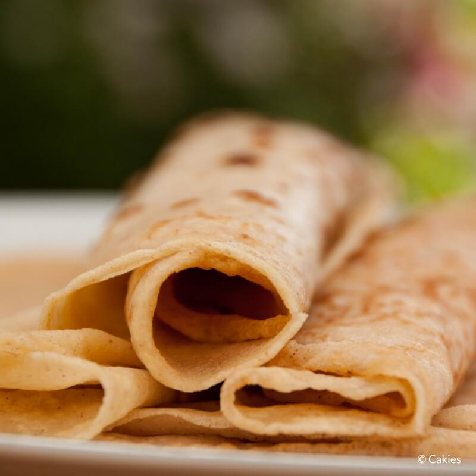

Pannenkoek

recept 
Voor de pannenkoeken heb je bloem, melk, eieren, een snufje zout en wat olie nodig. Daarnaast kan je eventueel ook wat suiker en kaneel toevoegen. Dat doe ik meestal als ik ze maak. Ik gebruik dan vanillesuiker. (De volledige lijst van ingrediënten inclusief de hoeveelheden kan je in de receptkaart onderaan vinden).